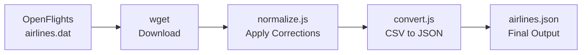

The airline-codes package syncs airline data from the upstream [OpenFlights.org](https://openflights.org) database maintained by [jpatokal/openflights](https://github.com/jpatokal/openflights). This ensures you always have access to the latest airline information.

## Automated Weekly Updates

The data is automatically updated every Monday at 6am UTC via GitHub Actions. The workflow:

<Steps>
  <Step title="Fetch Latest Data">
    Downloads the latest `airlines.dat` file from the OpenFlights GitHub repository
    
    ```bash
    wget https://raw.githubusercontent.com/jpatokal/openflights/master/data/airlines.dat
    ```
  </Step>
  
  <Step title="Apply Corrections">
    Runs `normalize.js` to apply local corrections for country names and data quality fixes
    
    ```bash
    node normalize.js
    ```
  </Step>
  
  <Step title="Regenerate JSON">
    Converts the corrected CSV data to JSON format with `convert.js`
    
    ```bash
    node convert.js
    ```
  </Step>
  
  <Step title="Commit & Publish">
    If changes are detected, the workflow automatically:
    - Bumps the patch version
    - Commits the updated data files
    - Pushes to the repository
  </Step>
</Steps>

<Info>
The automated workflow runs on the schedule defined in `.github/workflows/update-data.yml` and can also be triggered manually via the GitHub Actions interface.
</Info>

## Manual Updates

You can update the airline data manually at any time by running the data pipeline locally:

<Steps>
  <Step title="Install Dependencies">
    Make sure you have the required npm packages installed:
    
    ```bash
    npm ci
    ```
  </Step>
  
  <Step title="Download Latest Data">
    Fetch the current airlines.dat file from OpenFlights:
    
    ```bash
    wget https://raw.githubusercontent.com/jpatokal/openflights/master/data/airlines.dat
    ```
    
    This downloads the latest airline data in CSV format.
  </Step>
  
  <Step title="Apply Corrections">
    Run the normalization script to apply local corrections:
    
    ```bash
    node normalize.js
    ```
    
    This script reads `airlines.dat`, applies corrections from `COUNTRY_CORRECTIONS` and `ID_CORRECTIONS`, and writes the corrected data back to `airlines.dat`.
  </Step>
  
  <Step title="Generate JSON">
    Convert the corrected CSV to JSON format:
    
    ```bash
    node convert.js
    ```
    
    This creates `airlines.json` with all airline records as JSON objects, sorted with active airlines first.
  </Step>
</Steps>

<Note>
After running these commands, you'll have updated `airlines.dat` and `airlines.json` files ready to commit.
</Note>

## Data Pipeline Overview

The update process follows this pipeline:



### What Gets Updated

When you update the data, the following files are modified:

| File | Description | Format |
|------|-------------|--------|
| `airlines.dat` | Raw airline data with corrections applied | CSV |
| `airlines.json` | Structured airline data for the npm package | JSON |

<Warning>
Always run `normalize.js` before `convert.js` to ensure corrections are applied. Running `convert.js` alone will generate JSON from uncorrected upstream data.
</Warning>

## Triggering GitHub Actions Workflow

If you have write access to the repository, you can manually trigger the update workflow:

1. Go to the **Actions** tab in the GitHub repository
2. Select **Update Airline Data** from the workflow list
3. Click **Run workflow**
4. Choose the branch (usually `master`) and click **Run workflow**

The workflow will complete all update steps automatically and commit changes if new data is detected.

## Verifying Updates

After updating, you can verify the changes:

<CodeGroup>
```bash Check for differences
git diff airlines.dat
git diff airlines.json
```

```bash Count records
wc -l airlines.dat
cat airlines.json | jq '. | length'
```

```bash Check active airlines
cat airlines.json | jq '[.[] | select(.active == "Y")] | length'
```
</CodeGroup>

## Data Freshness

The OpenFlights database is community-maintained and updated regularly. The weekly sync ensures that:

- New airlines are added within days of being submitted upstream
- Defunct airlines are marked inactive
- Airline information changes (rebrands, mergers) are reflected
- IATA/ICAO code assignments stay current

<Info>
The package version is automatically bumped on each data update, so you can track data freshness via the version number in `package.json`.
</Info>